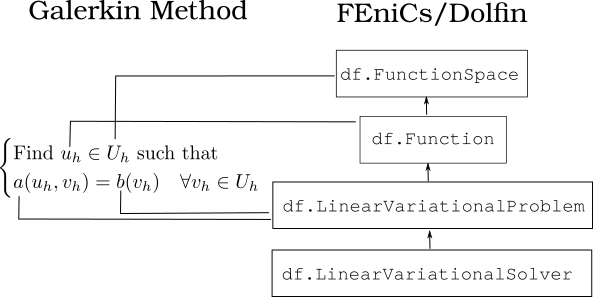
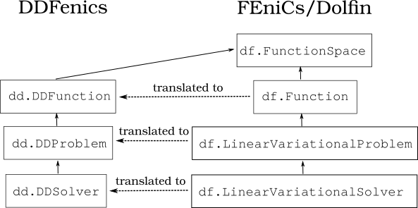
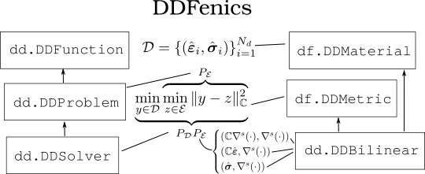

# WARNING : IN THE CURRENT STATE, THE LIBRARY IS BEING LARGELY MODIFIED. IT'S POSSIBLE SOME OF THE INSTRUCTIONS ARE DEPRECATED.

# DDFenics (X)
A (model-free) Data-driven implementation based on fenics (https://github.com/felipefr/ddfenics).
This version is compatible with Fenicsx 0.10 (still in a transition mode).

## Tutorial
Aim: Solve a simple 2D bar problem using standard Fenicsx and DDFenicsx.
- 1) 2D bar (linear elastic) in FEniCsx: tutorial/linear/main_bar.ipynb
- 2) 2D bar (linear elastic) in DDFenics(x) (Hands-on): tutorial/linear/main_bar_dd_to_fill.ipynb
  - Complete the "missing lines" (commented in the notebook) 
  - Plot the convergence (with data) curves
  - Run the sanity-check (last block of notebook) and redo DDCM
  - Change C = some isotropic elastic tensor (hookean) for changed (E', nu') ?
- 3) 2D bar (nonlinear elastic) in FEniCsx: tutorial/nonlinear/main_bar_nonlinear.ipynb
- 4) 2D bar (nonlinear elastic) in DDFenics(x): tutorial/nonlinear/main_bar_nonlinear_dd.ipynb

## Installation 

### Requirements
DDFenics relies on the following libraries/packages (some others are installed automatically altogether with the principal ones):
- library  /        version
- fenicsx   /        0.10   (conda-forge)
- scikit-learn /  latest or no restriction (conda-forge)
- matplotlib	/  latest or no restriction (conda-forge)

Optionally for mesh generation and postprocessing (with Paraview):
- library   /    version
- meshio    /    latest or no restriction (conda-forge)
- python-gmsh    /   latest or no restriction (conda-forge)

Optionally for an interactive run of the tutorial:
- library  /  version
- jupyterlab / latest or no restriction (conda-forge)
- ipykernel	 /  latest or no restriction (conda-forge)

Obs: the default repository is conda-forge, otherwise pypi from pip. Recommended versions should be understood only as guideline and sometimes the very same version is not indeed mandatory.

Obs: We included in the "external" folder a lite version of fetricks (https://github.com/felipefr/fetricks), that implements some auxiliary routines for computational mechanics using fenics. However, you can decide to use your own functions for this job. 

Obs: We recommend the use of miniconda (https://docs.conda.io/en/latest/miniconda.html) or your preferred Anaconda-like variants.

Obs: For Windows users, unfortunately Fenics is not available in the Anaconda repositories for Windows. As alternative, we recommend: i) to use the the Linux (Ubuntu) subsystem (https://learn.microsoft.com/en-us/windows/wsl/install) and use the instructions as below; ii) set some virtual machine (e.g. Virtual Box) or iii) use the Docker version of Fenicsx (not tested!) (https://fenicsproject.org/download/archive/).

Obs: Command to convert python notebooks to python files (if you prefer not use jupyter-lab): jupyter nbconvert --to script file.ipynb 

Obs: The bash install.sh is added as reference, but we recommend execute it line by line

## Documentation
1. Map between Galerkin-like variational approximation and FEniCs objects.

2. Map between FEniCs and the corresponding objects in DDFenics.

3. Map between (Model-free) Data-driven formulation and the corresponding objects in DDFenics.

### Basic Usage 

There two modes of usage:
1. (intrusive) The usage mimetises the basic framework of fenicsx by defining Data-driven equivalents of the Problem and Solver objects, respectively DDProblem and DDSolver. Additionally the DDProblem object depends on a Data-driven material (raw dataset instead of a constitutive equation), which is defined by an instance of a DDMaterial. The output of the DD solver also contains the mechanical and neighrest projections (in the material database) states, which are instances of DDFunction.

2. (non-intrusive (still not provided) ) This mode is designed to be used with an user-defined FEM solver. Fenicsx are still needed in some utilitary classes. The assembling related functions should be provided by the user. Here, we provide a example, using Fenicsx for the sake of convenience.    

#### Fenicsx

0. Definition of standard constitutive equations. 
1. Definition of mesh, FE spaces, boundary conditions, variational forms, etc. 
2. Variational problem definition: problem = LinearVariationalProblem(a, b, uh, bcs)
4. Solve the problem

#### DDFenics(x) (intrusive)
0. Definition of Data-driven constitutive equations : loading of material datasets and definition of an approximative metric ==> ddmat = DDMaterial(DB, Metric) 
1. Definition of mesh, FE spaces, boundary conditions, standard constitutive equations, variational forms, etc. (idem)
2. Definition of Gauss-Point spaces where the material states live : Sh0 = DDSpace(Uh.mesh(), 'DG', degree = 0 , dim = 3). 
Stresses and strains are instances of DDFunction(Sh0). 
3. DD Variational problem definition: problem = DDProblem(a, b, uh, bcs, ddmat, ddmat, state_mech, state_db) (almost idem)
5. Solve the problem: definition of DDSolver(problem, solver_args) then solve the problem (idem)

#### DDFenics(x) (non-intrusive - it should be improved, still not provided)
0. Definition of Data-driven constitutive equations : loading of material datasets and definition of an approximative metric ==> ddmat = DDMaterial(DB, Metric) 
1. Definition of Assembling routines and linear solver routines.
2. Definition of Gauss-Point spaces where the material states live : Sh0 = DDSpace(Uh.mesh(), 'DG', degree = 0 , dim = 3). 
Stresses and strains are instances of DDFunction(Sh0). 
3. DD Variational problem definition: problem = DDProblem(a, b, uh, bcs, ddmat, ddmat, state_mech, state_db) (almost idem)
4. Solve the problem: definition of DDSolver(problem, solver_args) then solve the problem (idem)

## Citing
Please cite this repository if this library has been useful for you.

## Todo:
DDProblemBase/bcsPF ?
